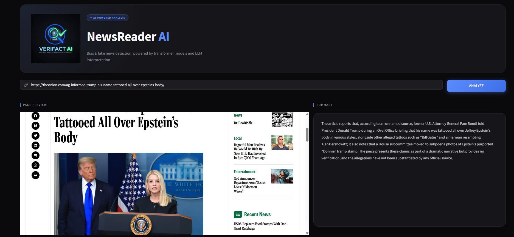
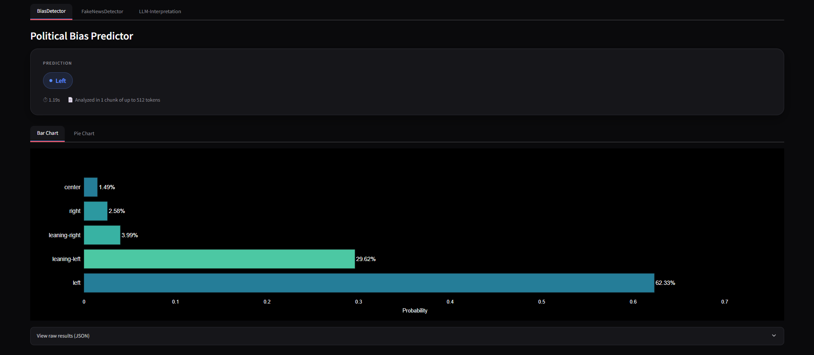
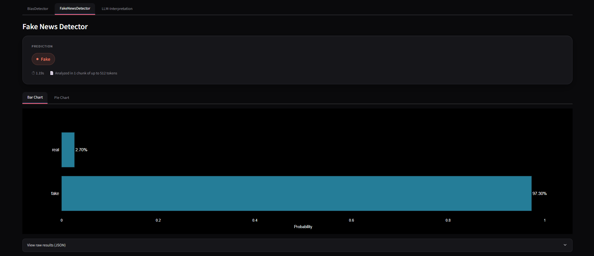
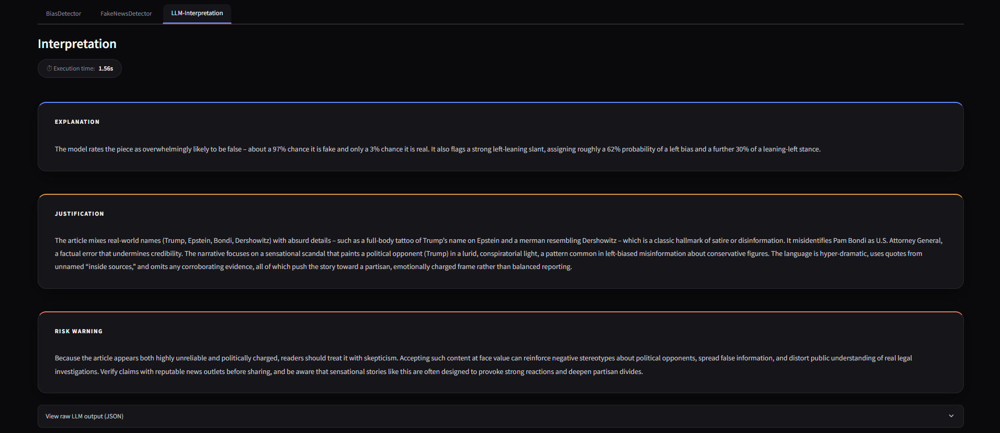

# NewsReader AI

A Streamlit application that analyzes news articles from a URL: it detects **political bias** and **fake news probability** using locally fine-tuned Transformer models, then uses an **LLM (Groq)** to generate a plain-language summary and a three-part interpretation of the results — explanation, justification, and a risk warning for the reader.




## Table of contents

- [How it works](#how-it-works)
- [Screenshots](#screenshots)
- [Prerequisites](#prerequisites)
- [Installation](#installation)
- [Environment variables](#environment-variables)
- [Models (`ModelsBias` / `ModelsFake`)](#models-modelsbias--modelsfake)
- [Running the app](#running-the-app)
- [Project structure](#project-structure)
- [What's committed to Git and what isn't](#whats-committed-to-git-and-what-isnt)
- [Known limitations](#known-limitations)

---

## How it works

Given a news article URL, the app runs the following pipeline:

1. **Scraping** — fetches the article with a plain HTTP request first; if that's blocked (anti-bot protection), it falls back to a headless Chrome browser via `undetected-chromedriver`. The raw HTML is then cleaned with `trafilatura` to extract just the article body.
2. **Summary** — the extracted text is sent to Groq to generate a short, neutral summary shown immediately while the rest of the analysis runs.
3. **Language handling** — the article's language is detected with `langdetect`. Since the classifier models are trained on English text, non-English articles are translated via Groq before classification (only as much text as the classifiers will actually use, to save time and API cost).
4. **Classification** — the (possibly translated) text is split into token chunks and run through two independent fine-tuned BERT-style models **in parallel**:
   - **Political bias** — 5 classes: left, leaning-left, center, leaning-right, right
   - **Fake news** — 2 classes: real, fake

   Long articles are split into multiple chunks (up to 512 tokens each), batched into a single forward pass per model, and the resulting predictions are averaged.
5. **LLM interpretation** — the original article text and both classifiers' results are sent to Groq, which returns a structured explanation, a justification of why the models likely reached that result, and a risk-analysis paragraph encouraging the reader to think critically about the article.

Results are displayed in three tabs (Bias Detector, Fake News Detector, LLM Interpretation), each with bar/donut charts (Plotly) and the raw JSON output available on demand.

## Screenshots

**Political Bias Predictor**



**Fake News Detector**



**LLM Interpretation**



## Prerequisites

- Python 3.10+
- Google Chrome installed (needed for the Selenium/`undetected-chromedriver` scraping fallback when the plain HTTP request is blocked)
- A free [Groq](https://console.groq.com/keys) API key

## Installation

```bash
git clone <your-repo-url>
cd newsreader-ai/deploy

python -m venv venv
source venv/bin/activate      # Windows: venv\Scripts\activate

pip install -r requirements.txt
```

> The app lives inside the `deploy/` folder — run every command from there, since `app.py` resolves paths (models, assets, `.env`) relative to its own location.

## Environment variables

Copy the template and fill in your own keys:

```bash
cp env.example .env
```

```
GROQ_API_KEY="your_groq_api_key_here"
NGROK_AUTH_TOKEN="your_ngrok_auth_token_here"   # only needed if you use start.ipynb to expose the app via a tunnel
```

⚠️ **Never commit your real `.env` file.** It's already listed in `.gitignore`.

## Models (`ModelsBias` / `ModelsFake`)

Model weights are **not included in this repository** (too large for GitHub) — they're hosted on the Hugging Face Hub:

- `ModelsBias` → [huggingface.co/JordiEncabo/newsreader-bias](https://huggingface.co/JordiEncabo/newsreader-bias)
- `ModelsFake` → [huggingface.co/JordiEncabo/newsreader-fake](https://huggingface.co/JordiEncabo/newsreader-fake)

### Download them

```bash
pip install huggingface_hub

huggingface-cli download JordiEncabo/newsreader-bias --local-dir ./ModelsBias
huggingface-cli download JordiEncabo/newsreader-fake --local-dir ./ModelsFake
```

This places the files exactly where `app.py` expects them — no code changes needed.

### Expected folder layout

```
ModelsBias/
├── config.json
├── label_encoder.pkl          ← project-specific file (not generated by from_pretrained)
├── model.safetensors
├── special_tokens_map.json
├── tokenizer_config.json
├── tokenizer.json
└── vocab.txt

ModelsFake/
├── config.json
├── model.safetensors           ← the one the code uses (use_safetensors=True)
├── special_tokens_map.json
├── tokenizer_config.json
├── tokenizer.json
└── vocab.txt
```

> `ModelsFake` on Hugging Face also contains `pytorch_model.bin` — a duplicate of the same model in the legacy format, never used by the code. You don't need to download it, and having it doesn't cause any issues, but you can remove it from the Hugging Face repo to make it lighter.

## Running the app

```bash
streamlit run app.py
```

The app opens at `http://localhost:8501`.

Alternatively, `start.ipynb` launches the app and exposes it publicly through an ngrok tunnel (requires `NGROK_AUTH_TOKEN` in your `.env`).

## Project structure

```
newsreader-ai/                      ← repository root
├── deploy/                         # The actual application — run everything from here
│   ├── core/                       # Business logic package
│   │   ├── __init__.py
│   │   ├── auto_scraper.py          # Article text extraction (requests + Selenium fallback)
│   │   ├── chunking_utils.py         # Splits/batches long text into token chunks for inference
│   │   ├── figuras.py                 # Plotly bar/donut charts of the class probabilities
│   │   ├── groq.py                     # Groq prompts and API calls (summary, translation, interpretation)
│   │   ├── predictor_bias.py            # Political bias model inference
│   │   └── predictor_fake.py             # Fake news model inference
│   ├── assets/
│   │   └── logo_oscuro.png          # Logo shown in the app header
│   ├── ModelsBias/                  ← NOT committed (see Models section)
│   ├── ModelsFake/                  ← NOT committed (see Models section)
│   ├── .env                         ← NOT committed (your real keys)
│   ├── app.py                       # Streamlit UI and pipeline orchestration
│   ├── env.example
│   ├── requirements.txt
│   └── start.ipynb                  # Optional ngrok launcher
├── .gitignore
├── LICENSE
└── README.md
```

## What's committed to Git and what isn't

| Item | Committed? | Why |
|---|---|---|
| `deploy/app.py` | ✅ Yes | App entry point |
| `deploy/core/` (all modules + `__init__.py`) | ✅ Yes | Business logic source code |
| `deploy/requirements.txt` | ✅ Yes | Needed to install dependencies |
| `deploy/env.example` | ✅ Yes | Template with no real keys |
| `deploy/assets/logo_oscuro.png` | ✅ Yes | Small file, and `app.py` needs it to start (raises `FileNotFoundError` otherwise) |
| `assets/screenshots/` | ✅ Yes | Used by `README.md` — small enough to commit |
| `deploy/start.ipynb` | ✅ Yes (optional) | Only if you want to keep the ngrok launcher |
| `.gitignore` | ✅ Yes | Needed for the rest of these rules to work |
| `README.md` | ✅ Yes | Documentation |
| `LICENSE` | ✅ Yes | Project license |
| `deploy/.env` | ❌ No | Contains your real keys — already in `.gitignore` |
| `deploy/ModelsBias/`, `deploy/ModelsFake/` | ❌ No | Too large for GitHub — hosted on Hugging Face, already in `.gitignore` |
| `__pycache__/`, `.ipynb_checkpoints/` | ❌ No | Auto-generated by Python/Jupyter |

## Known limitations

- The scraping fallback uses headless Chrome via `undetected-chromedriver`. If you deploy this app on a server/PaaS without Chrome installed (e.g. Streamlit Community Cloud without extra configuration), that fallback will fail silently and only the plain `requests` method will work.
- Models run on CPU by default. If your server has a GPU available, there's room to improve performance by moving the models to `cuda`.
- Groq's free tier applies rate limits (requests/minute and/or per day); the app retries automatically on a 429, but very heavy usage may still hit the daily cap.